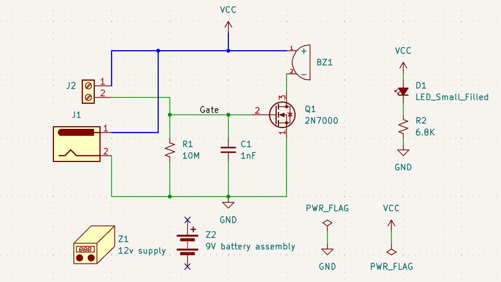
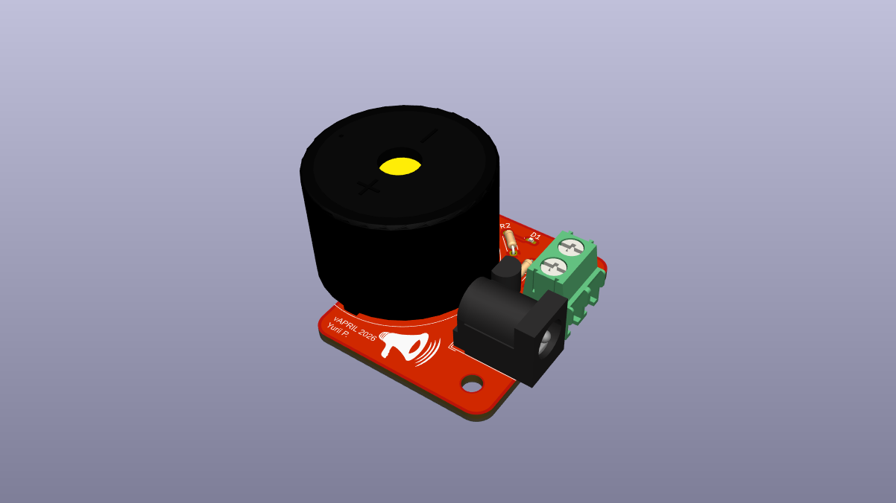

# Water alarm PCB

## Overview

This project was created by following a KiCad tutorial to learn the fundamentals of PCB design in KiCad.

The PCB integrates several components, including a buzzer, an LED, a MOSFET, a screw terminal, a DC jack, resistors and capacitors.

## Components

* [Buzzer](https://www.digikey.ca/en/products/detail/pui-audio-inc/AI-3035-TT-12V-R/9083403?s=N4IgTCBcDaIGxwBwFoCMcCsZkDkAiIAugL5A)
* [MOSFET](https://www.digikey.ca/en/products/detail/diotec-semiconductor/2N7000/13164314?s=N4IgTCBcDaICwA4DsCC0YBySAMuDCAKqhgCIgC6AvkA)
* [Screw terminal](https://www.digikey.ca/en/products/detail/adam-tech/EBAA-02-C/13586872?s=N4IgTCBcDa4AwFYDsBaAogIQIJZXMKAwigHIAiIAugL5A)
* [DC jack](https://www.digikey.ca/en/products/detail/same-sky-formerly-cui-devices/PJ-037A/1644545?s=N4IgTCBcDaIMIAUC0AGAzAdgIJIHIBEQBdAXyA)
* Resistors, capacitors, LED

## Features

* Indicator LED for status

## Tools Used

* KiCad (schematic capture and PCB layout)
* GitHub for documentation

## What I Learned

* Creating schematics in KiCad
* PCB component placement
* Trace routing and board organization

## Images

### Schematic

### 3D View

## Tutorial Reference

This project was created by following this tutorial:

- [KiCad 9.0 - Getting Started](https://www.youtube.com/watch?v=0WCi1rhueH4&list=PLEBQazB0HUyQ5YJSdCBb79orXaR3Uk5vm)
